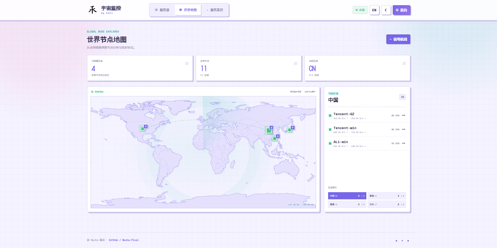
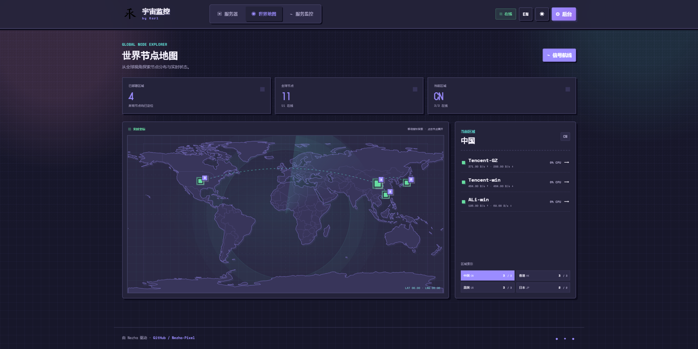

# Nezha Pixel

基于 Astro、TypeScript 和原生 CSS 的哪吒监控前台。项目保持原 `web` 的只读 API、实时状态、分组筛选、服务器详情、TSDB 曲线、服务监控、周期流量、语言和主题功能，视觉重新设计为掌机运维台风格。

## 特性

- 🎮 复古像素风格界面
- 📡 通过 `WebSocket` 实时刷新服务器状态（`/api/v1/ws/server`）
- 📊 服务器列表 + 单机详情 + TSDB 历史指标曲线（CPU / Mem / Disk / Net）
- 🔌 服务监控（HTTP/TCP/ICMP）可用率与循环流量统计
- 🌗 像素风明/暗双主题，自动持久化
- 🔍 按分组 / 在线状态过滤，按 CPU/MEM/网速排序
- 🛠 与官方 nezha-dash 完全相同的 API 路径与字段，可直接挂到现有 nezha 后端使用
- 📱支持多端兼容，移动端/PC页面完美显示

## 截图
| 场景 | 白日模式 | 黑夜模式 |
|:---:|:---:|:---:|
| 主页 |  |  |
| 简约 |  |  |
| 详情页 |  |  |
| 世界地图 |  |  |

## 后台自定义设置

主题会从官方 `GET /api/v1/setting` 接口读取站点名称、语言和“用户前端自定义代码”。官方主题变量中支持：`CustomLogo`、`CustomDesc`、`CustomBackgroundImage`、`CustomMobileBackgroundImage`、`CustomLinks`、`ForceTheme`、`ShowNetTransfer`、`ForceCardInline`、`ForceShowMap` 和 `ForceShowServices`。其中 `ForceTheme` 仅设置用户未主动选择主题时的默认显示。后台自定义代码中的样式与脚本也会按官方主题行为加载。

```html
<script>
    window.CustomLogo = 'https://example.com/xxx.png'
    window.CustomDesc = 'by Karl'
    window.ShowNetTransfer = true
    window.ForceShowMap= true
    window.ForceShowServices= true
    window.ForceTheme= 'light'
    window.ForceCardInline= false
    window.ForceCardInline = true
</script>
```

还可以在“用户前端自定义代码”中加入主题专属设置：

```html
<script>
window.NezhaPocketConfig = {
  accentColor: "#7767e8",
  showAdmin: true,
  showMap: true,
  showServices: true,
  footerText: "My Status Page"
};
</script>
```

未填写的配置均沿用主题默认值。

## Docker 部署

### 使用预构建镜像

启动前端容器：

```bash
docker pull ghcr.io/karllao/nezha-pixel:latest
docker run -d \
  --name nezha-pixel \
  --restart unless-stopped \
  -p 127.0.0.1:8081:80 \
  ghcr.io/karllao/nezha-pixel:latest
```

也可以使用 Compose：

```yaml
services:
  nezha-pixel:
    image: ghcr.io/karllao/nezha-pixel:latest
    container_name: nezha-pocket-console
    restart: unless-stopped
    ports:
      - "127.0.0.1:8081:80"
```

```bash
docker compose up -d
```

### 配置反向代理

前端请求同源的 `/api/`，其中包含实时状态使用的 WebSocket。Docker 镜像只提供静态前端，必须在 Caddy、Nginx 等外层反向代理中，将 `/api/` 转发到哪吒监控后端，其余请求转发到前端容器。例如宿主机 Caddy：

```caddy
status.example.com {
    encode zstd gzip

    # 1) Agent ↔ Dashboard 的 gRPC (h2c) —— 与官方模板完全一致，必须保留
    @grpcProto path /proto.NezhaService/*
    handle @grpcProto {
        reverse_proxy {
            header_up Host {host}
            header_up nz-realip {http.CF-Connecting-IP}  # CDN 透传的真实 IP header，CloudFlare 默认是 CF-Connecting-IP
            # header_up nz-realip {remote_host}          # 如果 Caddy 直接对外（不走 CDN），注释上一行、启用本行
            transport http {
                versions h2c
                read_buffer 4096
            }
            to 127.0.0.1:8008
        }
    }

    # 2) 原版 nezha 后台 + REST API + WebSocket —— 复用官方模板的 header_up
    @nezha path /dashboard /dashboard/* /api/v1 /api/v1/*
    handle @nezha {
        reverse_proxy {
            header_up Host {host}
            header_up Origin https://{host}              # 防止 nezha WS 因 Origin 校验拒绝升级
            header_up nz-realip {http.CF-Connecting-IP}
            # header_up nz-realip {remote_host}
            transport http {
                read_buffer 16384
            }
            to 127.0.0.1:8008
        }
    }

    # 3) 其它请求 → 像素前台
    handle {
        reverse_proxy 127.0.0.1:8081
    }
}
```

上例假设哪吒后端监听宿主机 `127.0.0.1:8008`。配置 HTTPS 后，访问 `https://status.example.com` 即可。

## Aseprite 素材

安装 Aseprite 后运行：

```bash
aseprite --batch --script scripts/pixel-assets.lua
```

脚本会生成 `public/assets/nezha-console.aseprite` 可编辑源文件及对应 PNG。页面核心视觉由 CSS 像素图形实现，因此缺少 Aseprite CLI 时不会影响构建和运行。


## 开发

```bash
npm install
npm run dev
```

默认代理到 `http://localhost:8008`。通过 `.env.local` 设置 `VITE_API_TARGET` 和可选的 `VITE_WS_TARGET` 可连接其他后端。修改环境变量后需要重启开发服务器。

```dotenv
VITE_API_TARGET=https://status.example.com
VITE_WS_TARGET=wss://status.example.com
# 自签名证书时启用：
# VITE_API_INSECURE=1
```

## 构建

```bash
npm run build
npm run build:user-dist
```

Astro 输出单页应用。部署服务器必须把 `/server/*` 等未知路径回退到 `index.html`，仓库中的 `nginx.conf` 已包含该规则。API 和 WebSocket 仍需由外层反向代理转发给哪吒后端。

### 打包内置主题发布文件

```bash
npm ci
npm run build:release
```

命令会在项目根目录生成 `dist.zip` 并校验包结构。哪吒 V1 的内置主题下载脚本要求发布附件必须名为 `dist.zip`，且 ZIP 根目录中必须保留 `dist/`：

```text
dist.zip
└── dist/
    ├── index.html
    ├── favicon.svg
    ├── _astro/
    └── assets/
```

不要进入 `dist/` 后只压缩其内容，否则哪吒官方的自动拉取脚本无法找到顶层 `dist` 目录。

## API

- `GET /api/v1/setting`
- `GET /api/v1/server-group`
- `GET /api/v1/service`
- `GET /api/v1/server/:id/service?period=1d`
- `GET /api/v1/server/:id/metrics?metric=...&period=...`
- `WS /api/v1/ws/server`
