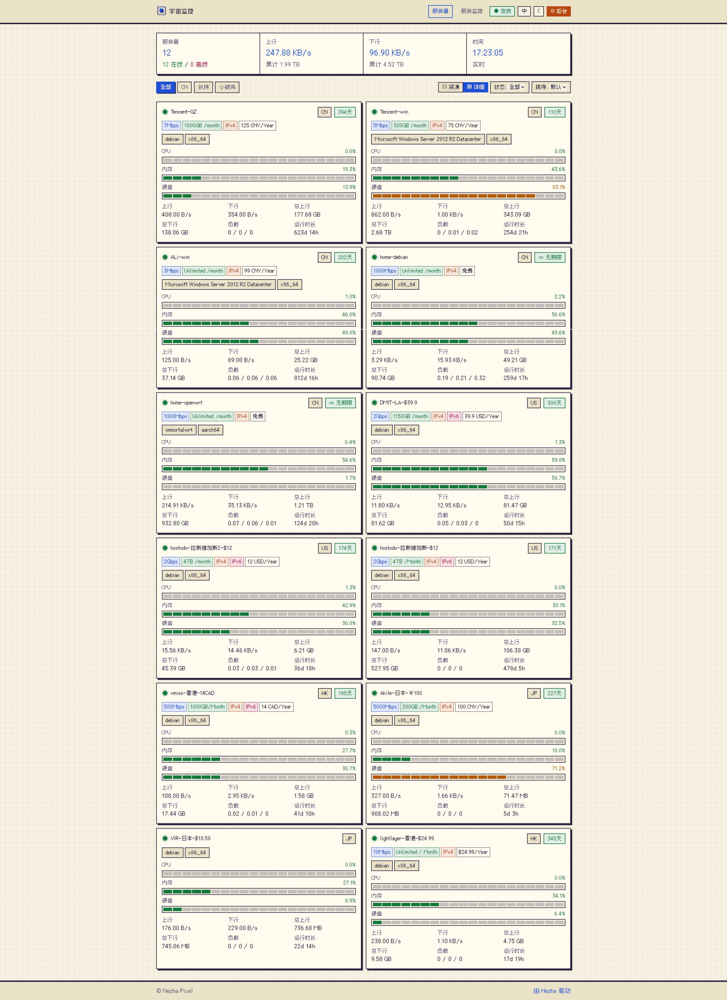
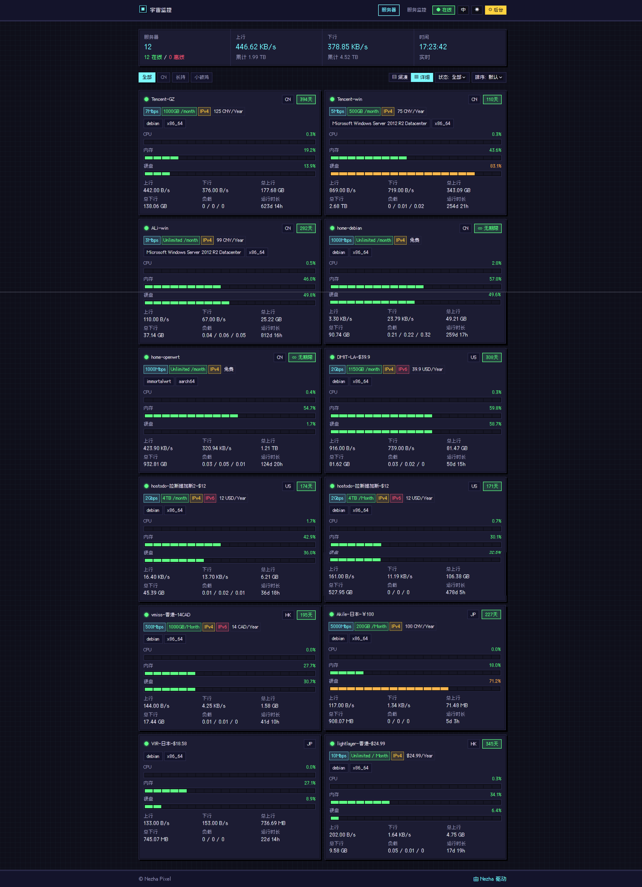
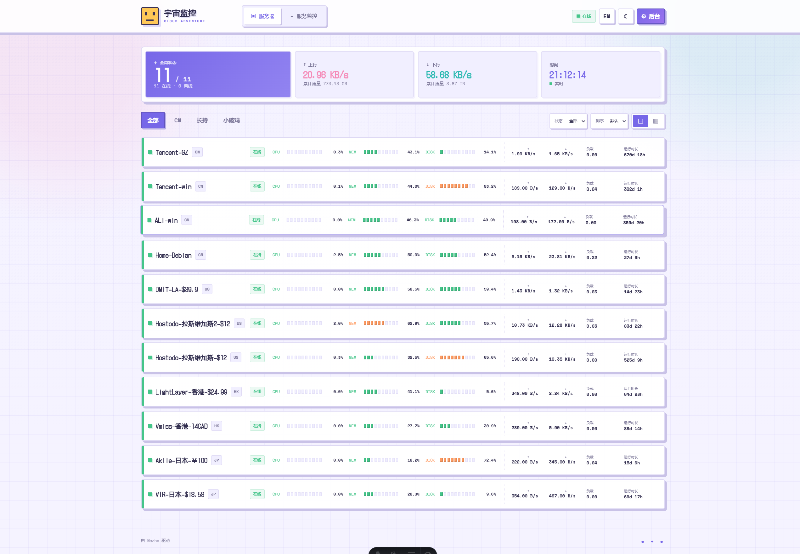
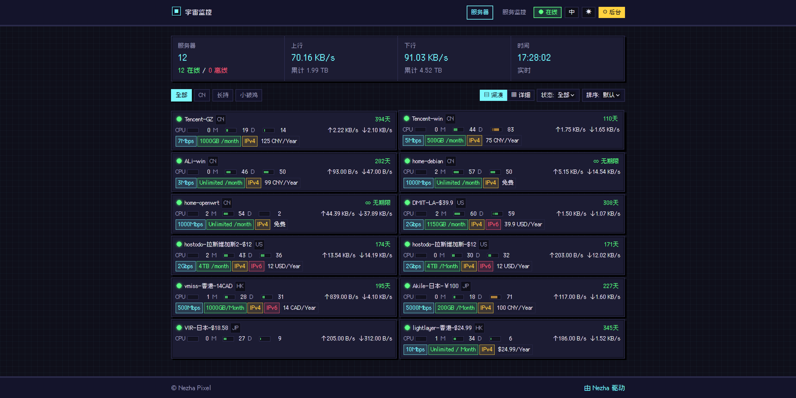
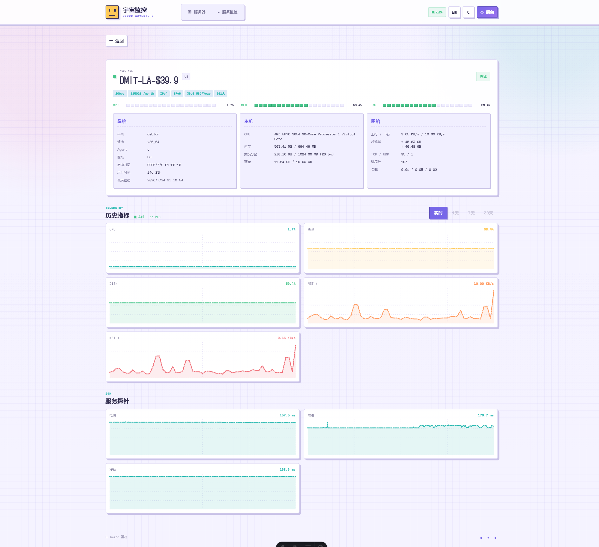
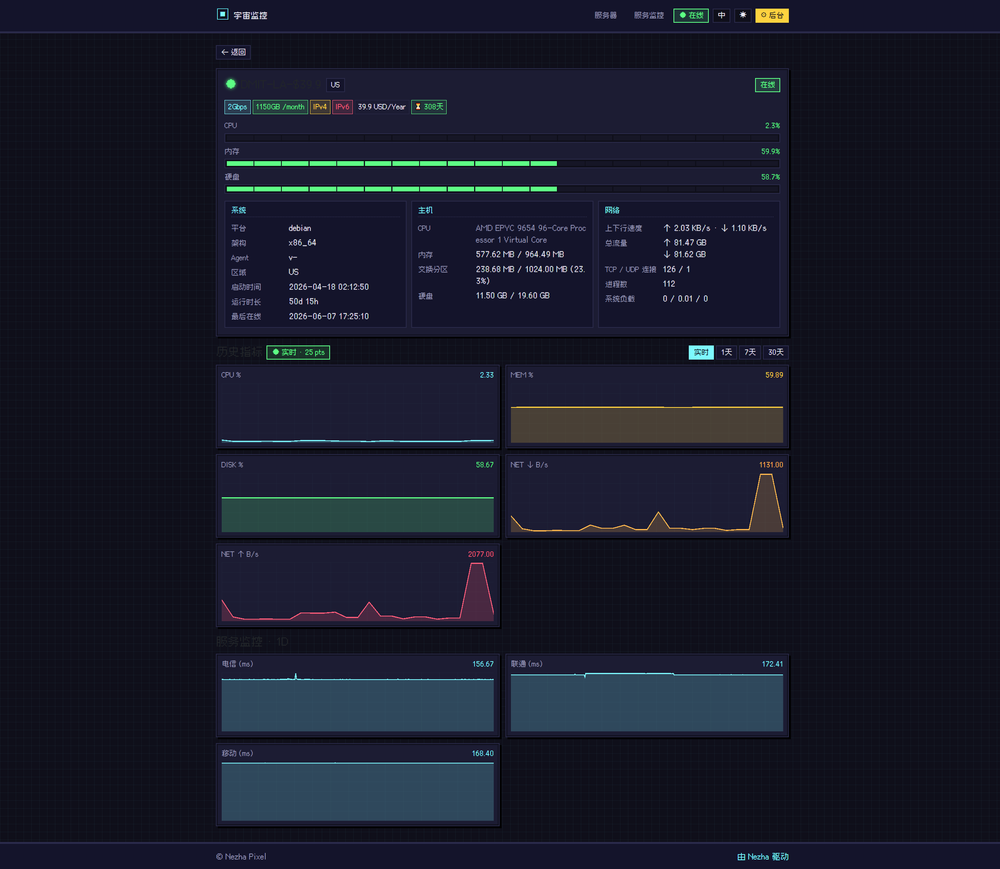

# Nezha Pixel

像素风格的 [哪吒监控 (Nezha)](https://github.com/nezhahq/nezha) 前台前端，基于 **Vue 3 + Vite + TypeScript** 与 **[@mmt817/pixel-ui](https://maomentai817.github.io/pixel-ui/)** 像素风组件库实现。

## 特性

- 🎮 复古像素风格界面（Press Start 2P + VT323 字体，CRT 网格背景）
- 📡 通过 `WebSocket` 实时刷新服务器状态（`/api/v1/ws/server`）
- 📊 服务器列表 + 单机详情 + TSDB 历史指标曲线（CPU / Mem / Disk / Net）
- 🔌 服务监控（HTTP/TCP/ICMP）可用率与循环流量统计
- 🌗 像素风明/暗双主题，自动持久化
- 🔍 按分组 / 在线状态过滤，按 CPU/MEM/网速排序
- 🛠 与官方 nezha-dash 完全相同的 API 路径与字段，可直接挂到现有 nezha 后端使用

## 截图
| 场景 | 白日模式 | 黑夜模式 |
|:---:|:---:|:---:|
| 主页 |  |  |
| 简约 |  |  |
| 详情页 |  |  |

## 项目结构

```
web/
├─ index.html
├─ vite.config.ts          # 含 /api/v1 与 /api/v1/ws/server 反向代理
├─ src/
│  ├─ api/nezha.ts          # API 客户端（fetch 封装）
│  ├─ types/nezha.ts        # 与 nezha swagger 对齐的类型
│  ├─ composables/websocket.ts  # WebSocket 状态管理（Pinia）
│  ├─ utils/format.ts       # 数据格式化与服务器信息派生
│  ├─ components/           # ServerCard / PixelBar / PixelChart 等
│  ├─ pages/                # HomePage / ServerDetailPage / ServicesPage
│  ├─ styles/global.css     # 全局像素风样式与 CSS 变量
│  ├─ router.ts
│  ├─ main.ts               # 注册 Pinia / Router / Pixel UI
│  └─ App.vue
└─ public/favicon.svg
```

## 开发

后端 nezha 默认监听 `:8008`。开发模式下 Vite 已配置代理：

```bash
cd web
npm install        # 或 pnpm install / bun install
npm run dev            # 默认 http://localhost:5173
```

如果后端地址不是 `localhost:8008`，请在 `vite.config.ts` 中调整 `proxy.target`。

## 连接线上后端调试

无需改代码，通过 `.env.local` 把代理指向线上 nezha：

```bash
cd web
cp .env.example .env.local
# 编辑 .env.local，填入线上地址
#   VITE_API_TARGET=https://your-nezha.example.com
npm run dev
```

打开 http://localhost:5173 即可，**页面 UI 走本地热更新，数据来自线上**。

- WebSocket 地址默认从 `VITE_API_TARGET` 自动推导（https → wss）。如线上 WS 走独立域名，再设 `VITE_WS_TARGET=wss://...`
- 自签名 / 不信任证书：在 `.env.local` 加 `VITE_API_INSECURE=1`
- 线上若开启了登录鉴权：先在浏览器登录线上一次拿到 cookie，再以同一域名 `http://localhost:5173` 调试；代理已开启 `cookieDomainRewrite` 自动改写 cookie 域，需要时也可手动把线上 cookie 拷贝到 `localhost`
- 跨域 / CORS：走 Vite 代理后浏览器只看到同源 `localhost:5173`，不会触发 CORS

> ⚠️ 调试线上数据等同于直连线上后端，**避免在调试中触发写接口**（虽然本前端只用读接口）。

## 构建

```bash
# 构建到 web/dist
npm  run build

# 直接构建到 nezha 后端的 user-dist 目录，便于嵌入打包
npm run build:user-dist
```

> `build:user-dist` 会输出到 `../nezha/dashboard/user-dist`，nezha 后端通过 `go:embed` 在 `dashboard` 目录下嵌入静态资源后即可作为默认用户前端。

## Docker 部署

### 直接 `docker run`

```bash
docker run -d \
  --name nezha-pixel-web \
  --restart=unless-stopped \
  -p 127.0.0.1:8081:80 \
  ghcr.io/karllao/nezha-pixel-web:latest
```

### docker-compose 示例

```yaml
services:
  nezha-pixel-web:
    image: ghcr.io/karllao/nezha-pixel-web:latest
    container_name: nezha-pixel-web
    restart: unless-stopped
    ports:
      - "127.0.0.1:8081:80"
```

### Caddy 反代示例

```caddy
status.example.com {
    encode zstd gzip

    # 1) 原版 nezha 后台（管理面板）
    @nezha_dashboard path /dashboard /dashboard/*
    handle @nezha_dashboard {
        reverse_proxy 127.0.0.1:8008
    }

    # 2) 原版 nezha API + WebSocket（Caddy 会自动识别 Upgrade 头升级 WS）
    @nezha_api path /api/v1 /api/v1/*
    handle @nezha_api {
        reverse_proxy 127.0.0.1:8008
    }

    # 3) 其它请求 → 像素前台
    handle {
        reverse_proxy 127.0.0.1:8081
    }
}
```

如果 nezha 后端和 Caddy 都在 docker compose 同一网络里，把 `127.0.0.1:8008` / `127.0.0.1:8081` 换成对应的 service 名即可，例如 `nezha:8008` / `nezha-pixel-web:80`。

访问效果：

| 入口 | 实际后端 |
| --- | --- |
| `https://status.example.com/` | 像素前台首页 |
| `https://status.example.com/server/1` | 像素前台单机详情（SPA 路由由容器 nginx 兜底） |
| `https://status.example.com/services` | 像素前台服务监控页 |
| `https://status.example.com/api/v1/...` | 原版 nezha REST API |
| `wss://status.example.com/api/v1/ws/server` | 原版 nezha WebSocket 实时推送 |
| `https://status.example.com/dashboard` | 原版 nezha 管理后台 |

> 如果你只想暴露像素前台、隐藏管理后台，把上面第 1 段 `@nezha_dashboard` 整段删掉即可——`/dashboard` 路径会被 SPA 兜底走到 404 页面。

## API 来源

所有接口与字段定义参考：

- Swagger: `nezha/cmd/dashboard/docs/swagger.json`
- 参考实现: [nezha-dash-v2](https://github.com/hamster1963/nezha-dash-v2)

| 路径 | 用途 |
| --- | --- |
| `GET  /api/v1/setting` | 站点配置与版本号 |
| `GET  /api/v1/server-group` | 服务器分组 |
| `GET  /api/v1/service` | 服务监控可用性 + 循环流量统计 |
| `GET  /api/v1/server/{id}/service` | 单机服务监控历史 |
| `GET  /api/v1/server/{id}/metrics?metric=cpu&period=1d` | 单机 TSDB 历史指标 |
| `WS   /api/v1/ws/server` | 全量实时状态推送 |

## 浏览器要求

Pixel UI 部分组件依赖 `CSS.paintWorklet`（CSS Houdini），需要 **HTTPS 或 localhost** 安全上下文，最新的 Chrome / Edge / Safari 都已支持。

## License

Apache-2.0
